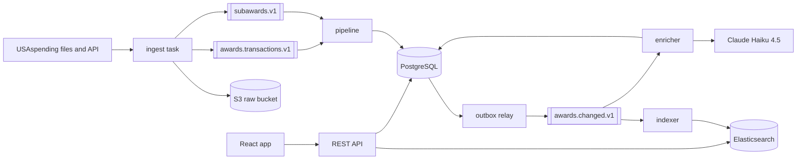

# AwardTrace

AwardTrace is a search site for U.S. federal contract awards. It loads the government's USAspending data through a Kafka pipeline, searches it with Elasticsearch, and gives each award a category from a Claude classifier that's scored against the government's own product codes.

**Live site:** [awardtrace.zntsns.com](https://awardtrace.zntsns.com). It runs weekdays from 8:00 to 20:00 Pacific and is stopped outside those hours to save money ([ADR 0017](docs/decisions/0017-host-runs-on-weekday-hours.md)). It holds the Department of Agriculture's contracts ([ADR 0018](docs/decisions/0018-production-holds-agriculture-only.md)).

## How it works



Double brackets are Kafka topics, and cylinders are stores. The ingest task, pipeline, outbox relay, indexer, enricher, and REST API are one Spring Boot application, started in different roles ([ADR 0001](docs/decisions/0001-modular-monolith-with-runtime-roles.md)). Production runs the long-running roles in one JVM on one EC2 host, and the ingest as a weekly task.

| Layer | Technology |
|---|---|
| Backend | Java 21, Spring Boot 4, Spring Modulith, Kafka in KRaft mode, PostgreSQL 18 with Flyway, Elasticsearch 9 |
| Classifier | Claude Haiku 4.5 through the Anthropic Java SDK, with Message Batches for the backfill |
| Web | React, TypeScript, Vite, TanStack Query |
| Infrastructure | Terraform on AWS: EC2, S3, ECR, SSM Parameter Store, and EventBridge Scheduler; Docker Compose on the host |
| Delivery | GitHub Actions: tests with Testcontainers, a coverage gate, an OpenAPI drift check, CodeQL, and a deploy on every merge to `main` |

## Results

The classifier and a baseline built from the government's product codes were both scored against 200 hand-labeled descriptions, under decision rules fixed before the runs ([ADR 0013](docs/decisions/0013-classifier-model-and-default-category.md)). Accuracy counts the 181 descriptions not labeled too vague to classify.

| Classifier | Accuracy | Cost per 100 descriptions |
|---|---|---|
| Product-code baseline | 59.7% | Free |
| Claude Haiku 4.5, the one the site uses | 65.7% | $0.021, or half that through Message Batches |
| Claude Opus 5.5, run once as a ceiling | 77.9% | $0.118 |

Haiku's 6-point lead clears the 3 points the rules required, though it isn't statistically significant. [docs/results.md](docs/results.md) has every run, and each run's report has its confusion matrix and misses. Search latency, ingest throughput, and the rebuild time aren't measured yet.

## What's interesting here

- **Out-of-order data.** Kafka keeps order only within a partition, so events are keyed by award, and every upsert still checks the source's version before it writes ([ADR 0004](docs/decisions/0004-kafka-keyed-by-award-id.md)).
- **The dual write.** Writing a row and then publishing an event can lose one of the two. A transactional outbox puts the event in the same transaction as the row ([ADR 0003](docs/decisions/0003-transactional-outbox.md)).
- **A modular monolith.** One developer and one event flow don't need microservices. It's one codebase with roles that can scale apart, and a test enforces the module boundaries ([ADR 0001](docs/decisions/0001-modular-monolith-with-runtime-roles.md)).
- **An LLM that has to earn its place.** The classifier's categories became the default only after it beat the free baseline on a hand-labeled set ([ADR 0007](docs/decisions/0007-llm-enrichment-is-optional-and-evaluated.md)). Every AI category on the site carries an AI badge, and the award page shows its confidence beside the product-code category.
- **Cost as a constraint.** One host, no managed Kafka, and a weekday schedule. PostgreSQL and Elasticsearch can be rebuilt from the raw files in S3, so the whole stack can be switched off and brought back ([ADR 0002](docs/decisions/0002-s3-raw-as-source-of-truth.md), [ADR 0006](docs/decisions/0006-single-node-infrastructure.md)).

## Run it locally

You need Docker, JDK 21, and Node.js 22.12 or later. From the repository root:

1. Start Kafka, PostgreSQL, Elasticsearch, and an S3 stand-in:

   ```sh
   docker compose -f infra/compose/compose.yml -f infra/compose/compose.local.yml up -d --wait
   ```

2. Load the Department of Agriculture's contracts, about 15 MB a fiscal year. The task exits when it's done:

   ```sh
   cd backend
   ./mvnw spring-boot:run -Dspring-boot.run.profiles=local,ingest -Dspring-boot.run.arguments=--awardtrace.ingest.task=backfill
   ```

3. Start the pipeline, the indexer, and the API:

   ```sh
   ./mvnw spring-boot:run -Dspring-boot.run.profiles=local,pipeline,indexer,api
   ```

4. In a second terminal, start the web app, then open http://localhost:5173:

   ```sh
   cd web
   npm ci
   npm run dev
   ```

Until the classifier runs, every category comes from the product codes. Running it needs an Anthropic API key and costs money; [eval/README.md](eval/README.md) shows how to set the key and run the evaluation.

## Documentation

| Where | What |
|---|---|
| [docs/decisions/](docs/decisions/) | The architecture decision records |
| [docs/results.md](docs/results.md) | The classifier's evaluation runs |
| [eval/README.md](eval/README.md) | The labeling guide, and how to run the evaluation |
| [backend/openapi.json](backend/openapi.json) | The API's contract, also served at `/api/v1/openapi.json` |

## License

[MIT](LICENSE)
